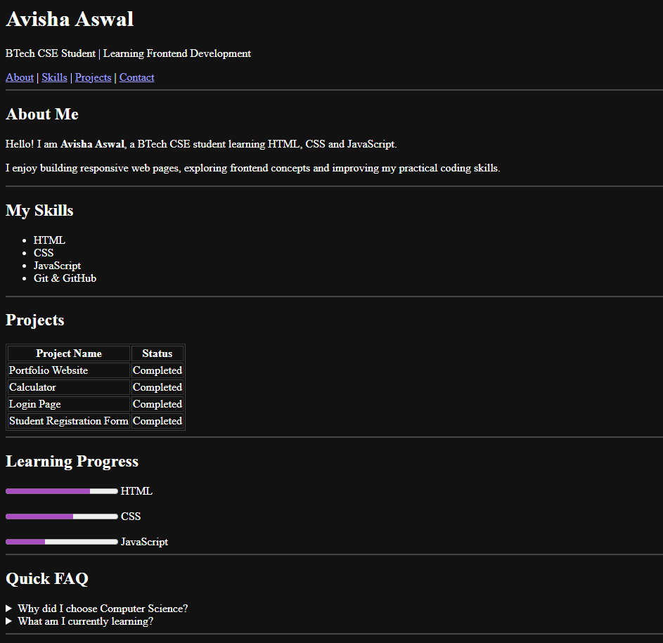
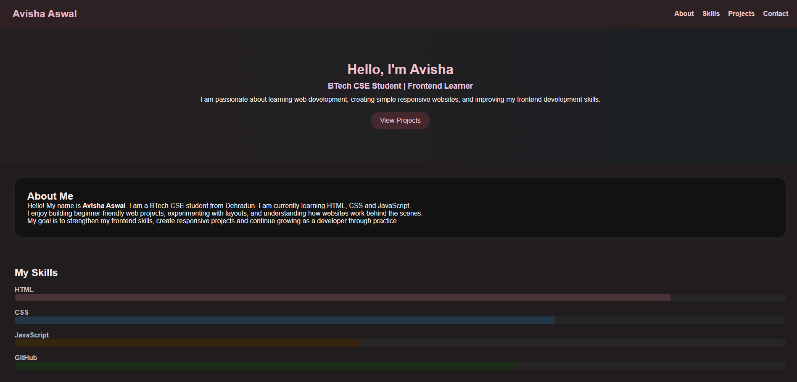
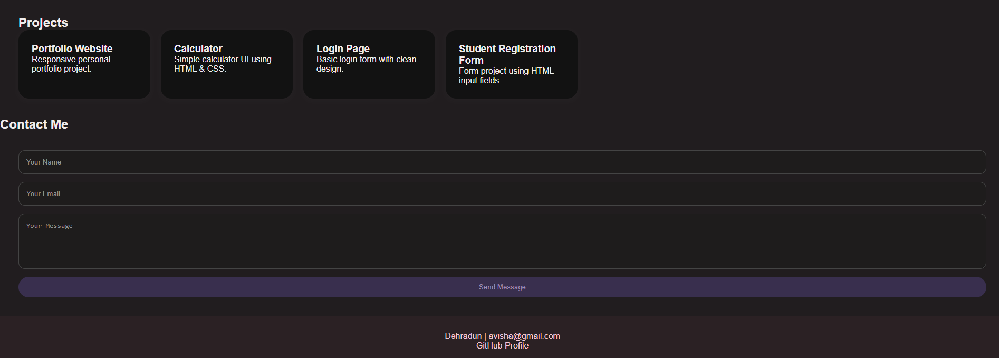

# Day 3 HTML & CSS Projects

## Project 1 – Personal HTML Project

Created a personal webpage using HTML only to practice webpage structure and semantic HTML elements. Added navigation links, about section, skills list, projects table, learning progress bar, FAQ section, contact form and footer.

### Result Screenshot

## Project 2 – Portfolio Website (HTML + CSS)

Created a personal portfolio website using HTML and CSS. Added navbar, introduction section, about section, skill bars, project cards, contact form, buttons and footer. Used Flexbox for layout alignment, colors for styling and media queries for responsive design.

### Result Screenshot

